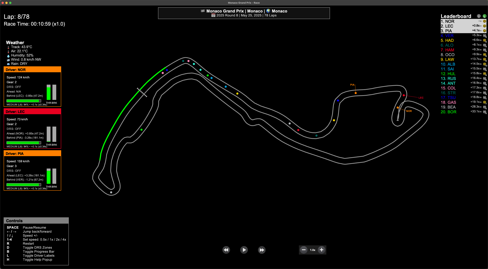
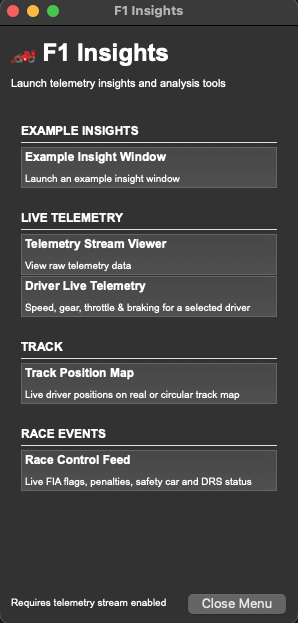

# F1 Race Replay - Visualization Critique

CS 6024 · Visualization in the Wild

Source: [github.com/IAmTomShaw/f1-race-replay](https://github.com/IAmTomShaw/f1-race-replay)
---

## Table of Contents

1. [Purpose](#1-purpose) 
2. [The Data](#2-the-data) 
3. [Target Users](#3-target-users) 
4. [Questions & Insights](#4-questions--insights) 
5. [Visual & Interaction Design](#5-visual--interaction-design) 
6. [Limitations](#6-limitations) 

---

## 1. Purpose

F1 Race Replay is an open-source Python desktop application that animates historical Formula 1 races using real telemetry data. The main purpose is to let fans and analysts re-experience a race as it actually happened, showing where every car was at every point in the race rather than just showing the final results.

The project fills a gap between two existing options for F1 data. Official broadcast replays are made for TV audiences and not for analysis, since camera angles are editorially chosen, the leaderboard is simplified, and events like safety cars or pit stops are narrated rather than fully shown. On the other end, tools like FastF1 and the official F1 Timing App give access to raw telemetry, but require programming knowledge to use. F1 Race Replay sits between these two options by making raw telemetry readable and interactive without requiring the user to write code.

A secondary purpose, mentioned in the project's roadmap and documentation, is for the application to work as an extensible platform. The "Pit Wall" architecture exposes a live telemetry stream that separate analysis windows can subscribe to, so the replay also acts as a data source for custom dashboards or research tools.

---

## 2. The Data

All data comes from [FastF1](https://github.com/theOehrly/Fast-F1), an unofficial Python library that wraps the official Formula 1 timing and telemetry APIs. F1 Management Ltd. provides this data through an endpoint originally built for live broadcast timing overlays. FastF1 downloads and caches it locally so repeated queries run faster.

The data itself is collected live during each race weekend by sensors on the cars, transmitted over a radio link to FIA Race Control, and then re-broadcast through F1's timing system.

### Driver Telemetry Channels

For each driver, the application samples the following channels at a rate that produces 25 frames per second of animation:

| Channel | Description | Source |
|---|---|---|
| X, Y Position | GPS-derived world coordinates of the car, used to draw each car's dot on the track. | Car telemetry beacon (~4 Hz raw, interpolated to 25 fps) |
| Speed | Car speed in km/h. | Car ECU / CAN bus |
| Gear | Current gear selection (1-8). | Car ECU / CAN bus |
| DRS | Binary flag for whether the Drag Reduction System flap is open. | Car ECU / CAN bus |
| Throttle % | Throttle pedal position as a percentage (0-100). | Car ECU / CAN bus |
| Brake | Brake pressure indicator. | Car ECU / CAN bus |
| Tyre Compound | Which tyre specification is fitted (Soft, Medium, Hard, Inter, Wet), encoded as an integer. | FIA Timing App lap data |
| Tyre Life | Number of laps the current tyre set has been used. | FIA Timing App lap data |
| Lap Number | The current lap being completed. | FIA Timing App |
| Race Position | Track position used to rank the leaderboard, derived from cumulative race distance. | Derived from cumulative race distance |

### Session-Level Data

Beyond per-car telemetry, the application also loads session-wide context:

| Data Type | Description |
|---|---|
| Track Status | Encoded flags from race control, such as code `4` for Safety Car deployed. This drives the Safety Car animation. |
| Race Control Messages | Official steward and race director messages broadcast during the session, covering penalties, investigations, and weather warnings. |
| Weather | Air temperature, track temperature, humidity, wind speed, wind direction, and a dry/wet rain state, sampled every few minutes by trackside sensors. |
| Session Info | Circuit name, event name, year, round number, total laps, and team color data from FastF1's plotting utilities. |

### An Important Caveat: The Simulated Safety Car

The official F1 API does not provide GPS telemetry for the Safety Car vehicle, only timing codes for when it is deployed. The application works around this by simulating the Safety Car's position, placing it approximately 500 meters ahead of the race leader on the track outline. This produces a reasonable animation, but it does not reflect the actual Safety Car's real location. Any analysis of Safety Car positioning based on this visualization would not be accurate.

---

## 3. Target Users

---

## 4. Questions & Insights

---

## 5. Visual & Interaction Design

F1 Race Replay makes a lot of intentional design choices. Some of them work well and some of them have room for improvement, usually because of the trade-offs involved in building a data-rich visualization as a small open-source project.

### What Works Well

**Team color encoding for driver dots**

Each driver is shown as a colored circle using their official team color, pulled from FastF1's plotting palette. This works well for the target audience because F1 fans already know that Red Bull is dark blue, Ferrari is red, and Mercedes is silver, so they can identify cars without needing to look at a legend. During busy moments on track like the race start or safety car restarts, the color coding helps viewers quickly read which groups of cars are together without needing any interaction.

**Live leaderboard with tyre compound icons**

The leaderboard on the right side of the screen updates in real time and shows each driver's tyre compound alongside their position. Tyre strategy is a major part of F1 races, so knowing that one driver is on older tires while a rival is on fresh ones changes how you read a position battle. By putting compound icons directly in the leaderboard rather than behind a click, the visualization keeps that context visible at all times without the user having to do anything.

**Flexible playback speed (0.1x to 256x)**

The application supports twelve playback speeds ranging from 0.1x to 256x. This covers a lot of different use cases: slow playback for studying a specific corner, normal speed for watching a race naturally, and very fast playback for scanning the full race arc quickly. Keyboard shortcuts for speed control, pause, and rewind also mean that users who know the shortcuts can control everything without taking their attention off the track.

**Safety Car animation with phase labels**

Since the Safety Car's GPS data is not available in the API, the visualization simulates its position and uses three distinct animation phases with labels: "SC DEPLOYING" with a pulsing glow, "SC" on track with an amber glow, and "SC IN" while returning to pits. Rather than hiding the limitation, the visual treatment communicates what is happening in the race while making it clear the position is estimated. The amber pulsing glow also conveys the urgency of a safety car period in a way that fits the visual language of motorsport.

**Insights Menu and Pit Wall architecture**

The telemetry stream runs as a local TCP server that separate windows can subscribe to. This means the main replay window handles the spatial animation while other analysis windows can display the same frame data simultaneously. This is a thoughtful architectural choice because it mirrors how a real F1 pit wall actually works, with different engineers watching different data streams on separate monitors. It also makes the tool extensible for users who want to build custom analysis on top of it.

---

### What Could Be Improved

**Leaderboard is inaccurate during the race start and pit stops**

The README itself acknowledges that the leaderboard is inaccurate during the first few corners and temporarily wrong when a driver is in the pits. This matters more than it might seem, because race position is the core data the visualization is built around. If the leaderboard is wrong at the race start or during pit windows, users could walk away with a wrong understanding of how the race actually played out. It would help to at least show some kind of uncertainty state during those transitions.

**Driver name labels are off by default and hard to discover**

Driver names on the track are hidden by default and turned on with the L key, but this shortcut does not show up clearly in the on-screen legend. For anyone who is not already an expert at reading team colors, this makes identifying individual cars on track very difficult during busy phases of the race. Turning names off probably helps with clutter, but the toggle should at least be visible in the legend so users know it exists.

**Driver detail panel interaction and context**

To view telemetry details for a driver, you click their entry in the leaderboard, which opens a small panel showing speed, gear, DRS status, and current lap. This works fine, but there are a couple of places where it could be improved. Being able to click directly on a car's dot on the track, or hover over it for a quick tooltip, would feel more natural, especially when the replay is paused or playing slowly and you are already looking at the track rather than the leaderboard. The detail panel could also be more helpful for people who are newer to F1 by showing the driver's full name and team name alongside the abbreviation, since not everyone will immediately know who "VER" or "NOR" is.

**Only three driver detail panels can be open at once**

The application limits users to three driver detail panels open at the same time. For comparing only a few cars this is fine, but if you want to track a wider group, it becomes a constraint. Being able to open more panels, or pop them out as separate moveable windows, would make it easier to do more complex comparisons.

**Speed and direction encoding as a possible addition**

The car dots are all the same size and do not indicate which direction a car is heading or how fast it is moving relative to the others. Adding something like a short motion trail or a directional indicator could help show the difference between a car at full speed on a straight versus braking for a slow corner. That said, with 20 cars on track at once this could easily make the visualization feel cluttered, so it would probably need to be implemented carefully, maybe as a toggle or only shown when zoomed in on part of the track.

**Additional Note**

It's worth noting that a few of the improvements mentioned above are actually already possible through the Insights Menu and Pit Wall window system, just not within the main replay window itself. The Pit Wall windows are separate, moveable windows by design, so the "pop out" behavior for Driver Live Telemetry detail panels is essentially already there as part of that system. The Telemetry Stream Viewer in the Insights Menu also shows data for all drivers simultaneously rather than being capped at three (although it's just pure data rather than a visualization) so the panel limit is more a constraint of the main HUD than of the tool as a whole. Lastly, the Track Position Map also shows driver labels and speed/direction encodings, so in some ways the extensibility of the architecture is the answer to its own limitations, it just requires the user to either build those windows themselves or wait for the community to contribute them.

---

### Design Summary

| Design Choice                         |         Verdict          | Reason                                                                           |
| ------------------------------------- | :----------------------: | -------------------------------------------------------------------------------- |
| Team color encoding for cars          |        Effective         | Leverages existing fan knowledge and enables quick visual parsing                |
| Live leaderboard with tyre icons      |        Effective         | Puts position and strategy data together without any interaction needed          |
| 0.1x to 256x playback speeds          |        Effective         | Covers everything from detailed analysis to full-race overview                   |
| Safety Car phase animation            |        Effective         | Good solution to a real data constraint, communicates the event clearly          |
| Pit Wall multi-window architecture    |        Effective         | Extensible and mirrors the real F1 pit wall metaphor well                        |
| Leaderboard inaccuracy at key moments |    Needs improvement     | Race position is the main data point, errors at critical moments undermine trust |
| Driver names hidden by default        |          Mixed           | Reduces clutter, but discoverability is poor for new users                       |
| Driver detail panel interaction       |          Mixed           | Leaderboard click works, but dot interaction and richer context would help       |
| Three-panel limit for driver details  |          Mixed           | Enough for simple comparisons, limiting for broader multi-driver analysis        |
| Speed/direction encoding              | Possible future addition | Could add useful context but risks visual clutter with 20 cars on track          |

---

## 6. Limitations

---

CS 6024 · Visualization in the Wild
